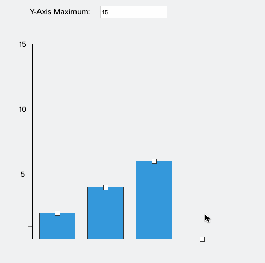

# React Bar Chart 📊


### Table of Contents

- [Introduction](#introduction)
- [Prerequisites](#prerequisites)
- [Installation](#installation)
  - [Running in dev mode](#running-in-dev-mode)
  - [Running test](#running-test)
- [Folder structure](#folder-structure)
- [Problem Statement](#problem-statement)
- [Solution Approach](#solution-approach)
  - [Data](#data)
  - [State mangement](#state-management)
  - [Render multiple bar charts](#render-multiple-bar-charts)
  - [Measurement and Units](#measurement-and-units)
  - [How does drag feature work?](#how-does-drag-feature-work)
- [Assumptions](#assumptions)
- [Features](#features)
- [Caveats and Limitations](#caveats-and-limitations)
- [Future Improvements](#future-improvements)
- [Tech Stack](#tech-stack)

## Introduction

React Bar Chart is a simple interactive bar chart application built with React and TypeScript. The components are designed to be flexible and customizable, allowing users to configure dimension of the bar chart, number of bars, initial frequency of each bar, and the Y-axis maximum of the chart. Users can also drag the bars to specific whole-number values, allowing interactive way to visualize the data.

## Prerequisites

Before setting up and running the project, ensure you have the following installed on your machine:

- [Node.js](https://nodejs.org/)
- [npm](https://www.npmjs.com/) or [yarn](https://yarnpkg.com/)

Since this project has been bootstraped using [Vite](https://vitejs.dev/), please read the compatibility note [here](https://vitejs.dev/guide/#scaffolding-your-first-vite-project)

**Compatibility Note**

> :information_source: Vite requires Node.js version 14.18+, 16+. However, some templates require a higher Node.js version to work, please upgrade if your package manager warns about it.

## Installation

1. Navigate to the project directory:

```
cd react-bar-chart
```

2.  Install the required dependencies:

```
npm install
```

### Running in dev mode

1.  Start the development server:

```
npm run dev
```

2.  Open your web browser and navigate to `http://localhost:5173/` to access the application.

### Running test

To run all the tests, run the following command:

```
npm test
```

To run a specific test file, pass the relative path to the test file as an argument to the npm test command. For example:

```
npm test src/utils/index.test.ts
```

## Folder structure:

Here is an overview of the key folders and their contents:

- `src/main.tsx`: Contains the entry point of the application
- `src/pages`: Contains the main App component
- `src/components`: Contains the Bar chart react components
- `src/context`: Contains the `BarChartStateProvider` and `useBarChart` hook
- `src/data`: Contains the mock data for the bar chart
- `src/types`: Contains the typescript types
- `src/constant.ts`: Contains the constants
- `src/index.css`: Contains the global styles

```
src
├── components
│   ├── Bar.tsx
│   ├── BarChart.tsx
│   ├── BarChartContainer.tsx
│   └── styles.ts
├── context
│   ├── BarChartStateProvider.tsx
│   ├── types.ts
│   └── useBarChart.ts
├── data
│   └── index.ts
├── pages
│   └── App.tsx
├── types
│   └── index.ts
├── constant.ts
├── index.css
└── main.tsx
```

## Problem Statement



- 1-4 bars can be configured via code
- Initial starting values can be set for each bar
- The user should be able to drag the columns to a particular whole-number value
- A read-only mode should be able to be set
- The Y-axis maximum can be set on initialisation and can be dynamically changed after rendering. Changing the Y-axis maximum should **not** change the dimensions of the graph itself (eg. if the graph is 300px × 300px, this should not change).
- The Y-axis should not be able to be set lower than the histogram columns
- The page should be able to have multiple components at a time

## Solution Approach

After looking at the provided sample gif, I am going to use the term **"Bar Chart"** to refer to the component that is being built.

**What is a Bar Chart? 📊**

> Bar chart is used to represent categorical data, which means the data is divided into distinct categories or groups. The categories are usually non-numeric, such as types of fruits, cities, or product names. Each bar in a bar chart represents a category, and the length or height of the bar corresponds to the quantity or frequency of that category.

> The X-axis of a bar chart represents the categories or groups being compared, and there is no inherent order or numerical scale associated with the X-axis labels.

> The Y-axis of a bar chart typically represents the frequency, count, or some other measure of each category or group. It is a measure of the categorical data's quantity.

### Data

Since we are dealing with a bar chart here, the frequency (y co-cordinates) of each category is more important. Hence, the structure of the data is modelled as follows.

```ts
interface BarChartData {
  id: number // unique id to identify each bar
  frequency: number // frequency of each bar
}

const mockData: BarChartData[] = [
  { id: 1, frequency: 10 },
  { id: 2, frequency: 5 },
  { id: 3, frequency: 14 },
  { id: 4, frequency: 8 }
]
```

The value of `frequencey` represents initial height of a bar which can be changed by the user later.

Since x-axis of a bar chart represents the categories or groups being compared, there is no numerical scale associated with the x-axis labels. Hence, the `id` is used to identify each bar.

### State management

The whole application state is managed using [React Context API](https://react.dev/reference/react/createContext). This eliminates the need to pass props down multiple component levels. With Context, state management becomes more centralized and predictable, as all child components can access the state via the context value.

By using context, child components can read and update y-axis maximum value, find the max frequency of the bar chart when the bars are dynamically changed by the user.
To implement the logic to prevent user to set max y-axis lower than the histogram columns, using context makes it easier since data is available to all child components.

The `BarChartStateProvider` component is responsible for managing the state and providing the state to the child components. It provides the context value of type `BarChartContext`.

```ts
// src/types/index.ts

interface BarChartContext {
  data: BarChartData[]
  maxYaxis: number
  dimension: BarChartDimenstion
  isBarChartReadyOnly: boolean
  setData: (data: BarChartData[]) => void
  setMaxYaxis: (maxYaxis: number) => void
  setIsBarChartReadyOnly: (isBarChartReadyOnly: boolean) => void
}
```

Child components can access the context value using `useBarChart` hook.

```tsx
// child component: src/components/BarChart.tsx
const BarChart = () => {
  const { data, setData, maxYaxis, isBarChartReadyOnly } = useBarChart()
  return <>...</>
}
```

### Render multiple bar charts

In order to render multiple bar charts, you can render multiple `BarChartContainer` components in the `App` component.

You can pass optional `data` and `dimension` props to render the bar chart with custom data and dimension.

```tsx
//src/pages/App.tsx

import BarChartContainer from '@/components/BarChartContainer'
import { mockData1, mockData2 } from '@/data'

const App = (): ReactElement => {
  return (
    <StyledWrapper>
      <BarChartContainer /> // default data will be used
      <BarChartContainer data={mockData1} /> // custom data
      <BarChartContainer
        data={mockData2}
        dimension={{
          width: 700,
          height: 500
        }}
      />{' '}
      // custom data & dimension
    </StyledWrapper>
  )
}
```

### Measurement and Units

- When the bar is rendered on the screen, the value of `frequency` in the data is converted by using a `MULTIPLIER` to get the height of the bar in pixels. The current default value of is 20 and defined in `src/constant.ts` file.
- Hence frequency of 1 will be converted to 20px, 2 to 50px and so on.

### How does drag feature work?

In order to understand how the drag feature works, open `src/components/Bar.tsx` file on the side and follow along.

- I am using `useRef` hook to get the reference of the bar and button elements.

- When the component gets mounted on the screen, the `useEffect` hook gets triggered and adds event listeners to the button and bar elements. If the user has checked marked the read-only checkbox, the event listeners are not added.

- When the user clicks on the bar's drag button, the `mousedown` event is fired and the `mousemove` event is fired continuously as the user moves the mouse. At this stage, we are updating the bar's height in the DOM.

- When the user decides to release the mouse, the height can be any value (eg: `379px`). But since our frequencies are in the interval of `20px` (because MULTIPLER = 20), we need to check if the height of the bar is a multiple of 20. If not, we need to round it to the nearest multiple of 20. Hence the following logic is used when the user releases the mouse.

```tsx
// src/components/Bar.tsx

const handleMouseUp = () => {
  // if height is not multiple of MULTIPLER then round it to nearest multiple of MULTIPLER
  if (height % MULTIPLIER !== 0) {
    height = Math.round(height / MULTIPLIER) * MULTIPLIER
    barElement.style.height = `${height}px`
  }
  ...
}
```

## Assumptions

- Since the X-axis of a bar chart represents the categories or groups being compared, and there is no order or numerical scale associated with the X-axis labels.
- The bar chart does not support negative values and restricts the user to drag the bar below the x-axis.
- The bar chart does not support decimal values and restricts the user to drag the bar to decimal values.
- The `INITIAL_Y_AXIS_MAX` value is set to 15 and defined in `src/constant.ts` file.
- The `MULTIPLIER` value is set to 20 and defined in `src/constant.ts` file.
- The default dimension of the bar chart is set to `GRAPH_WIDTH = 600` and `GRAPH_HEIGHT= 600` and defined in `src/constant.ts` file.These values are in pixels.

## Features

- [x] Render multiple bar charts on the same page with each bar chart maintaining its own state.
- [x] Render bar chart with custom bar chart dimension.
- [x] Render bar chart with custom data.
- [x] Allows user to drag the bar to a particular whole-number value.
- [x] Allows user to update the y-axis maximum of the bar chart.
- [x] Allows user to set the bar chart to read-only mode.
- [x] Prevents user to update the y-axis maximum of the bar chart when the bar chart is in read-only mode.
- [x] Prevents user to set y-axis maximum lower than the histogram columns.
- [x] Prevents user to set y-axis maximum greater than the bar chart dimension.
- [x] Changing the y-axis maximum should not change the dimensions of the graph itself.
- [x] Depending on the bar chart dimension, number of y-axis grid lines are rendered accordingly.

### Caveats and Limitations

- If you set height of the bar chart less than the `MULTIPILER` value or the frequency of the bars is greateer than the bar chart's height, the bar chart will not be rendered properly.This will cause the bars to go beyond the height of the bar chart.
- If the bar chart's width is very small compared to the number of bars, the bars will be rendered very close to each other and in some cases, the bars will go beyond the width of the bar chart.

### Future Improvements

- [ ] Add unit tests for react components
- [ ] Add support for negative values
- [ ] Allow user to set the MULTIPLIER value from the UI
- [ ] Allow user to set different colors for each bar
- [ ] Add support for labels on the x-axis
- [ ] Make the bar chart responsive on different screen sizes

### Tech Stack

- [Vite](https://vitejs.dev/): A fast frontend tooling for building web applications to bootstrap the project
- [Vitest](https://vitest.dev/): A Vite-native testing framework used for testing utils functions
- [Typescript](https://www.typescriptlang.org/): JavaScript with syntax for types
- [React](https://reactjs.org/): The library for building web applications
- [Styled Components](https://styled-components.com/): CSS-in-JS library for styling React components
- [prettier](https://prettier.io/) for code formatting
